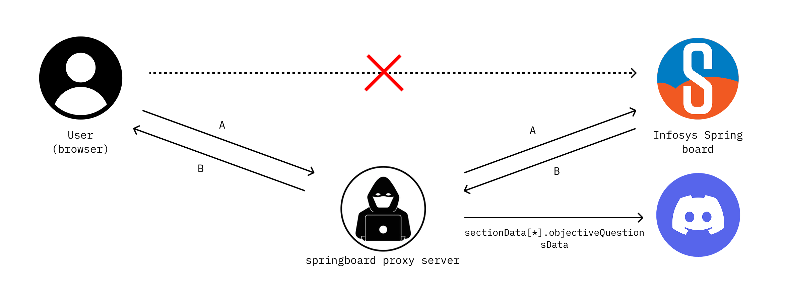

# Springboard Proxy

HTTPS intercepting proxy for extracting question data from [Infosys Springboard](https://infyspringboard.onwingspan.com) certification assessments. When an assessment is started in the browser, the proxy intercepts the API response containing the question bank, extracts all objective questions, and sends them to a Discord channel via webhook.

Built on [mitmproxy](https://mitmproxy.org/).



## How It Works

1. Browser traffic is routed through the proxy via FoxyProxy
2. When a certification assessment is started, the proxy intercepts the API response containing the question bank
3. Questions are extracted, saved to `assessment_sectionData.json`, and uploaded to Discord

### Supported Endpoints

| Platform | Host | Method | Path | Extraction |
|---|---|---|---|---|
| Springboard (legacy) | `lex-iap.infosysapps.com` | `POST` | `/backend/TakeContest/Proceed` | `sectionData[*].objectiveQuestionsData` |
| Springboard (Techademy) | `one.techademy.com` | `PATCH` | `/v1/tenant/user_attempts/*/auto_save` | `data.responses.sections[*].questions` |

## Getting Started

### Prerequisites

- Python 3.10+
- pip
- Firefox with [FoxyProxy](https://addons.mozilla.org/en-US/firefox/addon/foxyproxy-standard/)

### Installation

```bash
git clone <repo-url> && cd sprinboard-proxy
pip install -r requirements.txt
```

### Configuration

Create a `.env` file in the project root:

```env
DISCORD_WEBHOOK_URL=https://discord.com/api/webhooks/...
```

### Running

```bash
python proxy.py
```

| Flag | Default | Description |
|---|---|---|
| `-p`, `--port` | `9876` | Proxy listen port |
| `--listen-host` | `127.0.0.1` | Proxy listen host |
| `-q`, `--quiet` | off | Suppress mitmproxy event log |

### Browser Setup

1. Add a new proxy in [FoxyProxy](https://www.youtube.com/watch?v=MyJnuw7afX8): **Type** HTTP, **Host** `127.0.0.1`, **Port** `9876`
2. Activate the proxy profile
3. Navigate to **http://mitm.it** and install the CA certificate (required for HTTPS interception)
4. Go to Infosys Springboard and start a certification assessment
5. Questions will appear in your Discord channel

### CA Certificate (manual install)

If `http://mitm.it` doesn't work, import `~/.mitmproxy/mitmproxy-ca-cert.pem` manually:

- **Firefox**: Settings > Privacy & Security > Certificates > Import
- **System (Debian/Ubuntu)**:
  ```bash
  sudo cp ~/.mitmproxy/mitmproxy-ca-cert.pem /usr/local/share/ca-certificates/mitmproxy.crt
  sudo update-ca-certificates
  ```

## Project Structure

```
sprinboard-proxy/
├── proxy.py                  # Entry point
├── requirements.txt
├── .env                      # Discord webhook URL (not committed)
├── addons/
│   ├── logger.py             # Console + file logging for all traffic
│   ├── interceptor.py        # Question extraction from lex-iap and techademy
│   └── discord_helper.py     # Discord webhook file upload
└── logs/
    └── proxy.log             # Daily-rotated traffic log (30-day retention)
```
